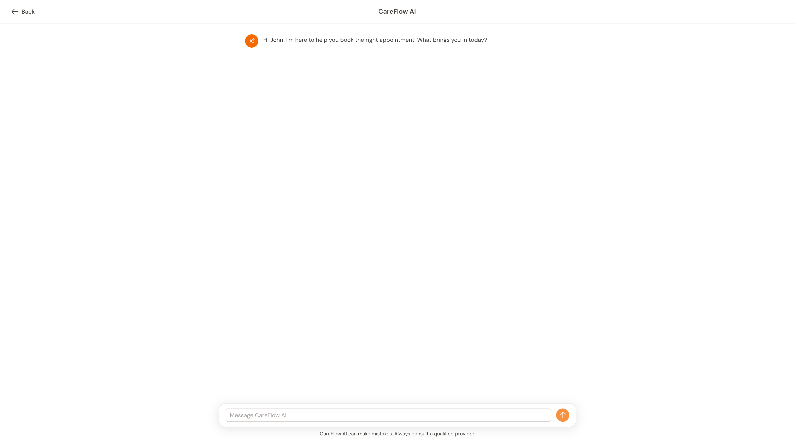
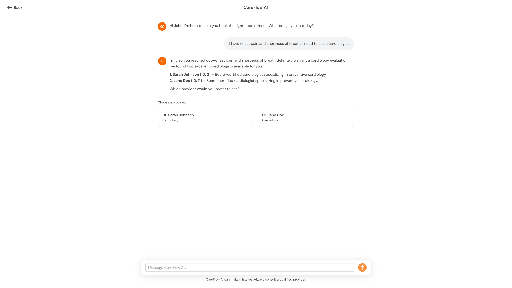
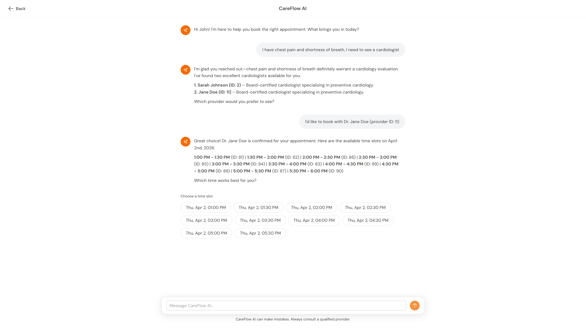
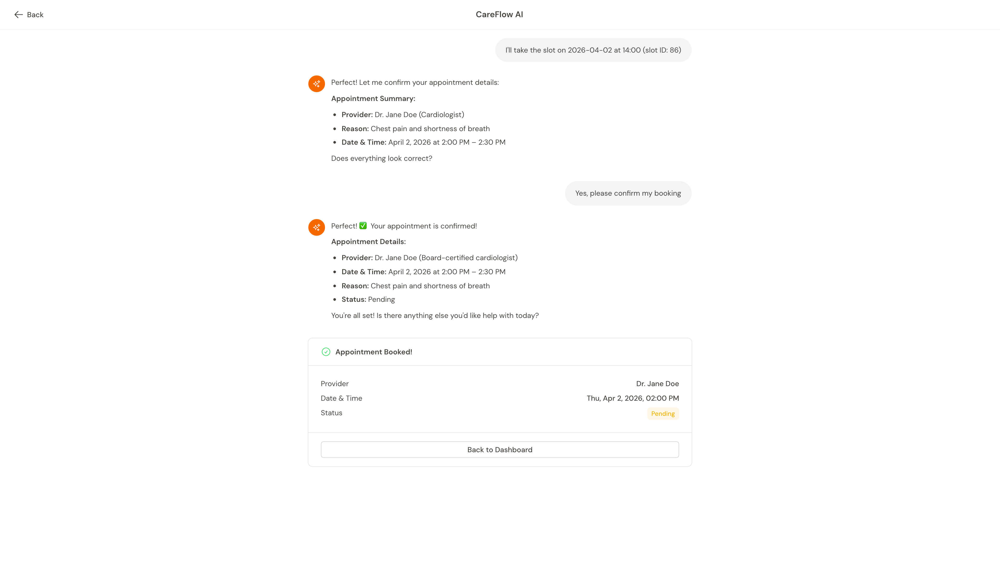
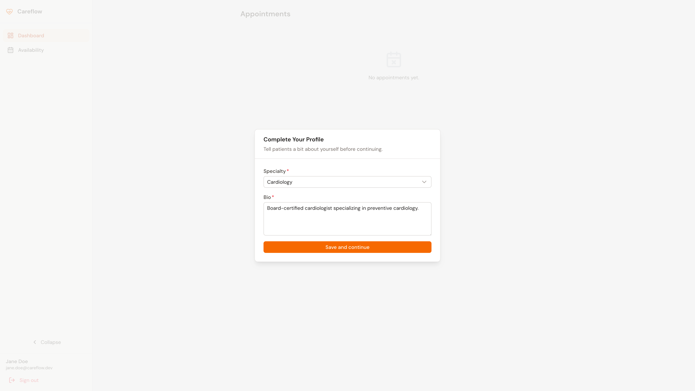
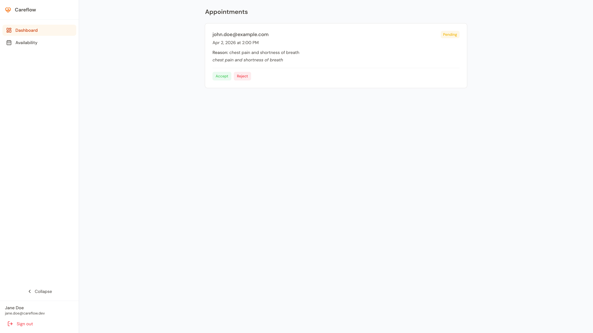
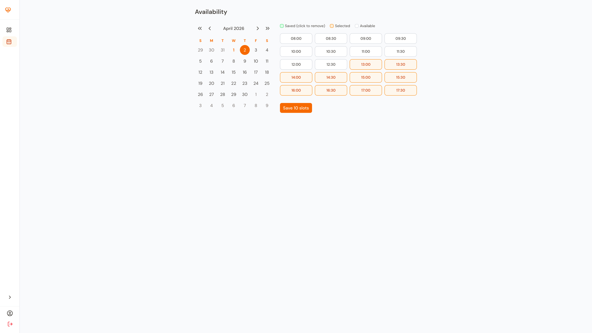
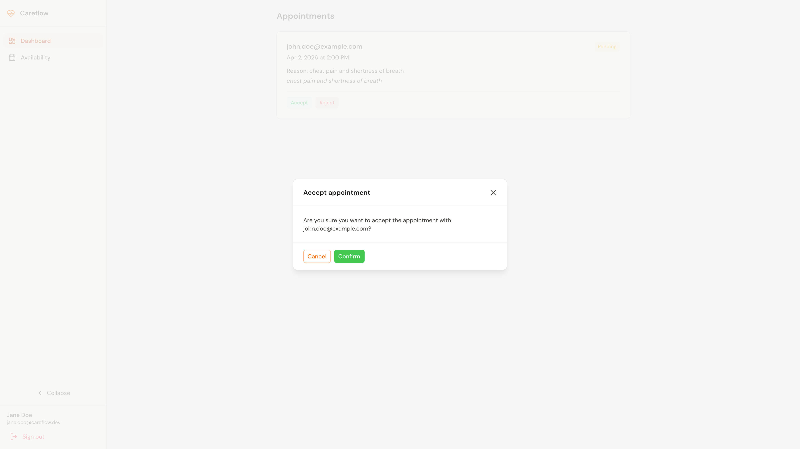

# CareFlow

An AI-powered medical appointment booking system. Members chat with an AI assistant to find a doctor and book an appointment; providers manage their availability and appointments through a separate dashboard.

---

## Features

**AI Booking Agent**

- Conversational booking flow: specialty → provider → time slot → confirmation
- Extracts structured intent from natural language (specialty, date preference, reason)
- Uses real provider and availability data — no hallucinated slots or names
- Maintains session state across multiple messages

**Member Flow**

- Sign up / log in
- Chat with the AI assistant to book an appointment
- View upcoming and past appointments on a dashboard

**Provider Flow**

- Sign up / log in with automatic profile creation
- Complete onboarding (specialty, bio)
- Manage availability slots (add, view, remove)
- View and manage incoming appointments

**Backend / Admin**

- JWT authentication with role-based access (member, provider, admin)
- Django admin with readable list views, search, filters, and inline availability management
- Auto-generated Swagger and ReDoc API documentation

---

## Demo Flow

1. A member signs up and opens the chat
2. Types: *"I need to see a cardiologist sometime next week"*
3. The AI extracts the specialty and reason, searches for available cardiologists, and presents them
4. The member picks a provider by number
5. The AI fetches open slots and the member selects one
6. The AI confirms the details and creates the appointment
7. The provider logs in, sees the new appointment on their dashboard, and can confirm or manage it

---

## Screenshots

**AI Booking Chat**

<p align="center">
  
  &nbsp;&nbsp;
  
</p>
<p align="center">
  
  &nbsp;&nbsp;
  
</p>

**Provider Dashboard**

<p align="center">
  
  &nbsp;&nbsp;
  
</p>
<p align="center">
  
  &nbsp;&nbsp;
  
</p>

---

## Tech Stack

**Backend**

- Django 5 + Django REST Framework
- PostgreSQL
- Simple JWT (1-hour access tokens, 7-day refresh)
- drf-spectacular (OpenAPI schema, Swagger UI, ReDoc)
- Anthropic Claude Haiku (AI agent)

**Frontend**

- Vue 3 + Vite
- Nuxt UI + Tailwind CSS
- Pinia (state management)

**Infrastructure**

- Docker Compose (backend, frontend, database as separate services)
- Vite proxy for local `/api/*` → Django

---

## Project Structure

```
careflow/
├── backend/              # Django project
│   ├── config/           # Settings, root URLs, WSGI
│   ├── users/            # Custom user model, auth endpoints
│   ├── providers/        # ProviderProfile, ProviderAvailability
│   ├── appointments/     # Appointment model and API
│   └── agent/            # AI orchestrator, BookingSession, chat API
├── frontend/             # Vue 3 app
│   └── src/
│       ├── views/        # member/ and provider/ page components
│       ├── components/   # Shared UI components
│       ├── stores/       # Pinia stores
│       └── api/          # API client layer
├── prompts/              # Externalized LLM prompt templates
│   └── agent/            # 4 prompt files (extraction + reply, system + user)
├── docker-compose.yml
└── .env.example
```

---

## Setup

**Requirements:** Docker and Docker Compose

```bash
# 1. Clone and configure environment
cp .env.example .env
# Add your ANTHROPIC_API_KEY to .env

# 2. Build and start all services
docker compose up --build

# 3. Run database migrations
docker compose exec backend python manage.py migrate

# 4. Seed providers with availability (optional but recommended)
docker compose exec backend python manage.py seed_providers

# 5. Create an admin user (optional)
docker compose exec backend python manage.py createsuperuser
```

**Seed data**

The `seed_providers` command creates 10 provider accounts (one per specialty) with availability slots for the next 7 weekdays — enough to test the full booking flow immediately.

| Name | Specialty | Email | Password |
|---|---|---|---|
| Dr. John Smith | General Practice | dr.smith@careflow.dev | password123 |
| Dr. Sarah Johnson | Cardiology | dr.johnson@careflow.dev | password123 |
| Dr. Raj Patel | Dermatology | dr.patel@careflow.dev | password123 |
| Dr. Lisa Chen | Endocrinology | dr.chen@careflow.dev | password123 |
| Dr. Carlos Garcia | Gastroenterology | dr.garcia@careflow.dev | password123 |
| Dr. Mina Kim | Neurology | dr.kim@careflow.dev | password123 |
| Dr. Emily Brown | Pediatrics | dr.brown@careflow.dev | password123 |
| Dr. Michael Taylor | Psychiatry | dr.taylor@careflow.dev | password123 |
| Dr. Amanda Wilson | Radiology | dr.wilson@careflow.dev | password123 |
| Dr. David Lee | Surgery | dr.lee@careflow.dev | password123 |

Each provider gets two daily slots: **09:00–12:00** and **13:00–17:00**. The command is idempotent — safe to run multiple times.

```bash
# Seed only 3 providers with 14 days of availability
docker compose exec backend python manage.py seed_providers --count 3 --days 14
```

**URLs**

| Service | URL |
|---|---|
| Frontend | <http://localhost:5173> |
| Backend API | <http://localhost:8000/api/> |
| Swagger UI | <http://localhost:8000/api/docs/> |
| ReDoc | <http://localhost:8000/api/redoc/> |
| Django Admin | <http://localhost:8000/admin/> |

---

## API Overview

| Group | Prefix | Description |
|---|---|---|
| Auth | `/api/auth/` | Register, login, token refresh |
| Providers | `/api/providers/` | List and search providers |
| Provider Profile | `/api/provider/profile` | Provider's own profile (self) |
| Availability | `/api/availability/` | Manage provider time slots |
| Appointments | `/api/appointments/` | Create and manage appointments |
| Agent | `/api/agent/` | AI booking chat (send message, get session) |

Full schema available at `/api/schema/` or interactively at `/api/docs/`.

---

## Prompt Architecture

Prompts are stored in `prompts/agent/` as plain text files, separate from application code:

```
prompts/agent/
├── 01_extraction_system.txt   # Instructs the LLM to extract structured booking fields
├── 02_extraction_user.txt     # User-turn template for extraction (with placeholders)
├── 03_reply_system.txt        # Instructs the LLM to act as CareFlow AI assistant
└── 04_reply_user.txt          # User-turn template for reply generation
```

`backend/agent/prompts.py` is a thin loader — it reads these files at startup and exposes them as constants. This keeps prompt text versionable, reviewable, and decoupled from Python code.

---

## Example Booking Scenario

```
User:      I have chest pain and need to see a cardiologist
CareFlow:  I can help with that. Here are the cardiologists available:
           1. Dr. Sarah Chen — Cardiology
           2. Dr. James Park — Cardiology
           Which one would you prefer?

User:      Let's go with Dr. Chen
CareFlow:  Here are her available slots:
           1. 2026-04-07, 09:00–10:00
           2. 2026-04-08, 14:00–15:00
           Which works for you?

User:      The first one
CareFlow:  Got it! To confirm — booking with Dr. Sarah Chen on April 7th at 9:00 AM
           for chest pain. Shall I confirm this appointment?

User:      Yes
CareFlow:  Your appointment is booked. See you on April 7th at 9:00 AM.
```

---

## Architecture Notes

The agent uses a **single orchestrator** (`backend/agent/orchestrator.py`) rather than a multi-agent or tool-calling framework. Each message goes through two LLM calls:

1. **Extraction** — structured JSON output: what specialty, which provider, which slot, confirmed?
2. **Reply** — natural language response given the current booking step

Between those two calls, a deterministic state machine decides what backend tool to run (`search_providers`, `get_available_slots`, `create_appointment`). The LLM never invents provider or slot data — it only selects from what the backend returns.

This approach was chosen over a more complex agentic loop because:

- It's predictable and easy to debug
- Tool calls are deterministic (no LLM choosing when/how to call them)
- It fits the scope of a 2-day take-home without sacrificing the core AI interaction

---

## Future Improvements

- **Smarter extraction** — handle ambiguous or multi-turn intent more gracefully
- **Email / push notifications** — appointment confirmation and reminders
- **Richer availability** — recurring schedules, buffer times, cancellation windows
- **Appointment rescheduling** — let members modify or cancel through chat
- **Production hardening** — rate limiting, async task queue, proper secret management
